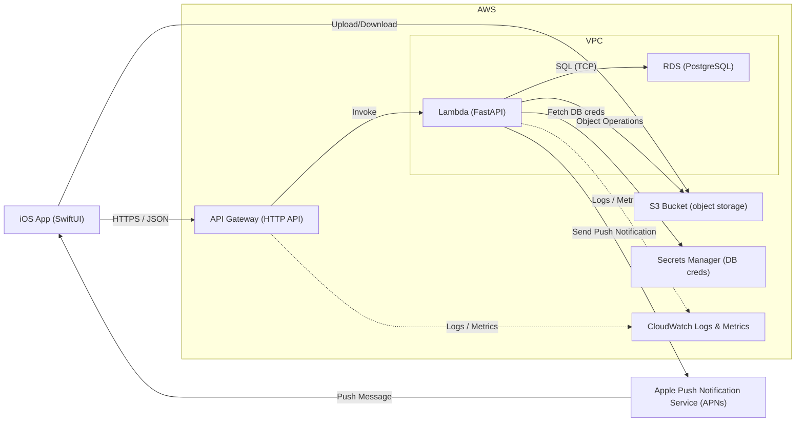

# Puctee Backend API

A FastAPI-powered backend service for lateness prevention iOS application. This project demonstrates modern backend development practices, complex database relationships, real-time notifications, and location-based services.

> 📱 **Frontend Repository**: The iOS app for this backend is on [puctee](https://github.com/KojiroTsugaru/puctee).

## 🚀 Project Overview

Puctee Backend is a comprehensive social planning API that helps friends coordinate meetups with built-in accountability features. Users can create plans, invite friends, set penalties for tardiness, and track attendance through location-based check-ins. The platform promotes punctuality and reliability through gamified trust scoring and social accountability.

## 🛠️ Tech Stack

- **Framework**: FastAPI (Python 3.11+)
- **Database**: PostgreSQL with SQLAlchemy (Async ORM)
- **Authentication**: JWT tokens with bcrypt password hashing
- **Notifications**: Apple Push Notification service (APNs)
- **Server**: Uvicorn (ASGI)
- **Testing**: pytest with FastAPI TestClient
- **Documentation**: Auto-generated OpenAPI/Swagger docs

- ## 🏗️ Architecture

The Puctee backend follows a modern serverless architecture using AWS services and FastAPI.



## ✨ Features

- **User Authentication**: JWT-based secure authentication and user management
- **Friend System**: Send/accept friend requests with bidirectional relationship management
- **Plan Management**: Create events, invite participants, track attendance status
- **Location Services**: GPS-based check-ins for plan verification
- **Accountability System**: Penalty management with proof submission for tardiness
- **Trust Scoring**: Gamified reliability tracking based on punctuality history
- **Real-time Notifications**: Push notifications with APNs for invitations, updates, and reminders
- **Complex Relationships**: Advanced SQLAlchemy patterns with eager loading optimization

## 📚 API Documentation

### Key Endpoints
- **Authentication**: `/auth/login`, `/auth/signup`, `/auth/refresh`
- **Users**: `/users/me`, `/users/me/trust-stats`
- **Friends**: `/friends/invite`, `/friends/accept/{invite_id}`, `/friends/{friend_id}`
- **Plans**: `/plans/`, `/plans/list`, `/plans/{plan_id}/checkin`

### Testing

Run the test suite:
```bash
pytest -v
```

Run with coverage:
```bash
pytest --cov=app -v
```

## 🔧 Development

### Code Quality
- **Type Hints**: Full type annotation support
- **Pydantic Models**: Request/response validation with complex schemas
- **Async/Await**: Full async implementation for database operations
- **Error Handling**: Comprehensive exception handling and validation
- **Testing**: Unit tests with pytest and FastAPI TestClient

### Key Implementation Details

#### Advanced SQLAlchemy Patterns
- **Async ORM**: Non-blocking database operations for better performance
- **Eager Loading**: Complex relationship loading to prevent N+1 queries
- **Many-to-Many Relationships**: Bidirectional friend system and plan participants
- **MissingGreenlet Handling**: Proper async context management

#### Real-time Features
- **Real-time Notifications**: Push notifications with APNs for invitations, updates, and reminders
- **Location Services**: GPS-based check-in verification
- **Trust Scoring**: Gamified reliability system with streak tracking

#### Database Design
```python
# Example of complex eager loading
result = await db.execute(
    select(Plan)
    .options(
        selectinload(Plan.participants),
        selectinload(Plan.invites).selectinload(PlanInvite.user),
        selectinload(Plan.locations),
        selectinload(Plan.penalties)
    )
    .where(Plan.participants.contains(user))
)
```

## 🌟 Technical Highlights

- **Complex Relationship Management**: Successfully implemented bidirectional friendship system
- **Async SQLAlchemy Mastery**: Resolved lazy loading issues in async contexts
- **Real-time Notification System**: Integrated Firebase for reliable push notifications
- **Location-based Features**: GPS verification system for plan attendance
- **Gamification Elements**: Trust scoring system to encourage user engagement

## 📝 License

This project is part of a portfolio showcase. Feel free to use as reference for your own projects.

## 🤝 Contributing

This is a portfolio project demonstrating advanced FastAPI development patterns, complex database relationships, and real-time notification systems.

---

**Built with ❤️ using FastAPI, SQLAlchemy, and modern Python development practices**
